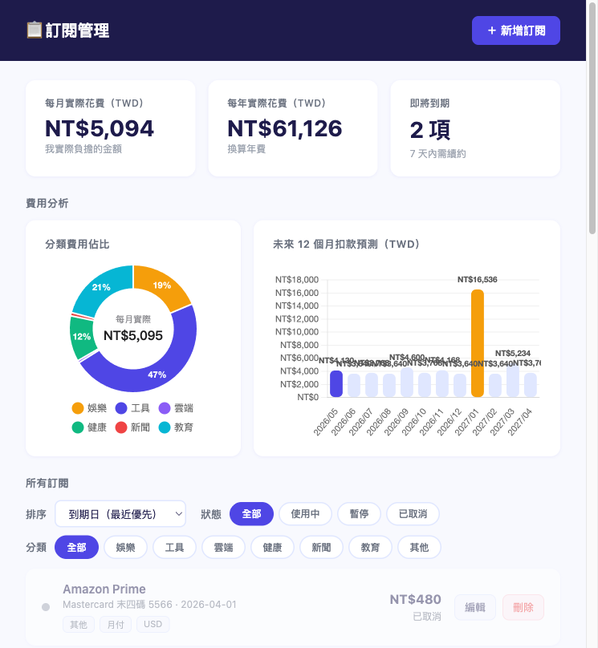
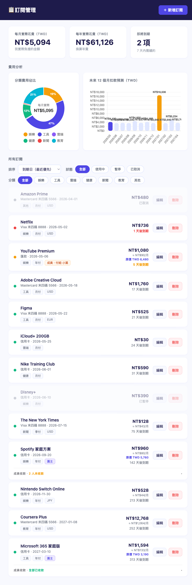
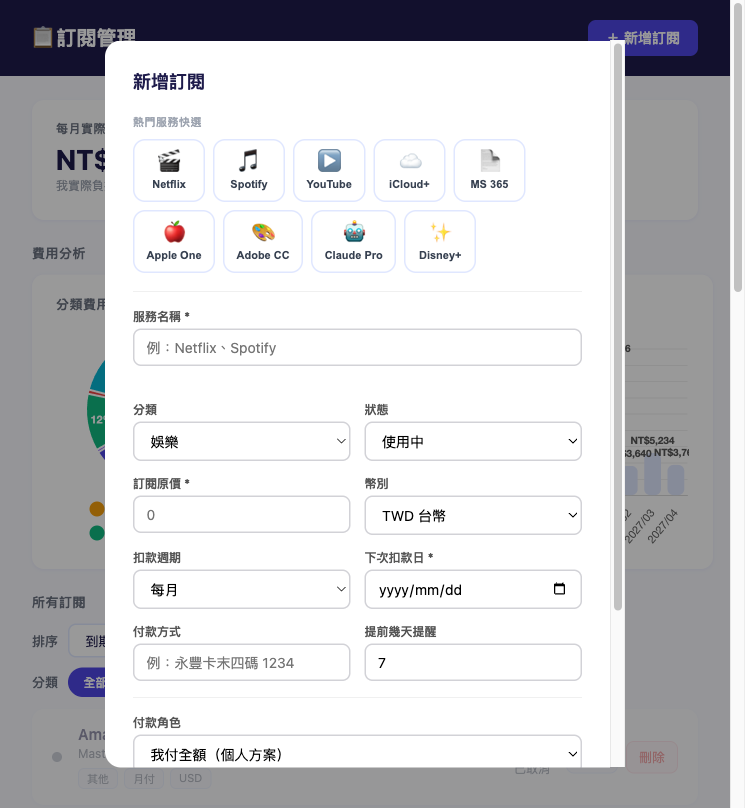

# 📋 訂閱管理工具

一個跑在本機的個人訂閱費用管理工具，解決「不知道自己每個月訂閱花了多少錢」的問題。



---

## 為什麼做這個

訂閱制服務越來越多，有些月付、有些年付、有些是家庭方案分攤——費用散落在不同信用卡帳單裡，很難一眼看清楚實際花了多少。市面上的工具不是要訂閱費就是資料放雲端，所以選擇自己做一個：資料完全在本機，沒有第三方，免費。

---

## 功能

### 核心管理
- 新增 / 編輯 / 刪除訂閱，記錄名稱、金額、幣別、週期、到期日、付款方式
- 支援 TWD、USD、JPY、EUR 四種幣別，自動換算（即時匯率，每 24 小時更新）
- 狀態管理：使用中 / 暫停 / 已取消

### 家庭方案
- **個人方案**：我付全額
- **成員模式**：記錄我的分攤金額和付給誰
- **團主模式**：管理成員名單、追蹤各成員是否已回補金額



### 費用視覺化
- 甜甜圈圖：各分類每月實際花費佔比
- 長條圖：未來 12 個月扣款預測，自動標示高峰月份
- 統計卡片：每月 / 每年實際花費（以我實際負擔的金額計算，非訂閱原價）

### 提醒與排序
- Telegram Bot 主動推播到期提醒，macOS 每天早上 9 點自動執行
- 排序：到期日（近 / 遠）、月費換算（高 / 低，年付自動換算為月費比較）
- Chip 篩選：分類 × 狀態，一鍵切換

### 快速新增
點擊熱門服務圖示（Netflix、Spotify、iCloud+ 等 9 個），自動帶入分類、幣別、週期，並展開對應方案供選擇（例如 iCloud+ 的 50GB / 200GB / 2TB）；選完方案後金額也同步填入，大幅減少手動輸入。支援 `<datalist>` 打字自動建議，涵蓋 20 個服務。



---

## 技術架構

| 層級 | 技術 |
|------|------|
| 後端 | Node.js + Express |
| 前端 | 原生 HTML / CSS / JS（無框架） |
| 圖表 | Chart.js 4.4 + chartjs-plugin-datalabels |
| 資料 | JSON 檔案，每日自動備份，保留 7 天 |
| 匯率 | @fawazahmed0/currency-api（免費，每日更新） |
| 安全 | 僅綁定 127.0.0.1、helmet 安全標頭、Origin/Referer 驗證、input 白名單驗證 |
| 通知 | Telegram Bot API + macOS LaunchAgent |

---

## 本地啟動

```bash
# 安裝依賴
npm install

# 啟動 server（預設 port 3456）
node server.js
```

打開瀏覽器前往 `http://127.0.0.1:3456`

> **Telegram 提醒設定**：複製 `.env.example` 為 `.env`，填入 Bot Token 和 Chat ID，即可啟用每日到期提醒推播。

---

## 開發過程

這個工具從需求到上線完全以 AI 協作開發，過程中刻意從三個角色切入思考：

**PM**：先定義核心痛點（不知道花多少）、邊界（不需要雲端、不需要帳號）、MVP 範圍，再逐步迭代家庭方案、提醒功能等進階需求。

**UX/UI**：從實際操作痛點出發——年付和月付費用無法比較、下拉篩選太慢、操作後沒有回饋——逐一優化成月費換算顯示、Chip 篩選、Toast 通知。

**RD**：刻意選擇最小依賴（純 JSON 不用資料庫、原生 JS 不用框架），並在安全性（localhost only、input 驗證）、資料安全（自動備份）、可維護性（拆分 CSS / JS 檔案）上做到生產品質。
